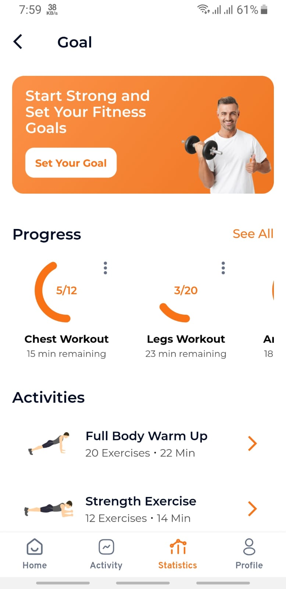

# Fitness Tracking App

## Project Owner
This project is owned and maintained by [Margub Morshed](https://www.linkedin.com/in/morshed-raian-khan-%F0%9F%87%A7%F0%9F%87%A9-b0199021a/)

## Description
Introducing the Fitness Tracking App, a sophisticated solution crafted with Feature-First Architecture to deliver an unparalleled fitness management experience. Designed with attention to user-centric features, this app integrates advanced technologies and modern UI enhancements to support users in achieving their fitness goals efficiently and effectively.

## Key Features
- **State Management with Provider:** Utilizing the "Provider" package for superior state management, ensuring smooth and reliable data flow while maintaining clear separation of concerns.

- **Feature-First Architecture:** Utilizing a Feature-First approach to architecture for enhanced scalability and maintainability, making it easy to integrate new features and manage complex functionalities.

- **Clean Code with Detailed Comments:** Our codebase boaosts clean and well-organized code, complemented by detailed comments for enhanced readability and maintainability, streamlining the development process.

- **Model Classes for Data Management:** Harnessing model classes, we optimize data storage and circulation, delivering a seamless user experience.

- **Responsive Design:** Ensuring optimal performance and visual appeal across all devices and screen sizes with a fully responsive layout.

- **Elegant Typography:** Incorporating the "Montserrat" font for a modern and clean look, enhancing readability and user engagement.

- **Custom Navigation Bar:** A uniquely designed navigation bar for seamless and intuitive user interaction, enhancing overall usability.

- **Dynamic Badges:** Featuring badges to highlight important updates, achievements, and notifications, keeping users informed and motivated.

- **Innovative Carousel Slider:** A custom-modified carousel slider with unique animations and interactive elements for an engaging visual experience.

- **Progress Visualization:** Employing a percentage indicator to provide a clear and smooth visual representation of progress, helping users track their fitness journey effectively.

- **International Date Formatting:** Implementing international date formats to ensure accurate and localized date representation for a global user base.

- **Advanced Charting and Graphs:** Utilizing "Syncfusion" and "FLChart" libraries for fully customized graphs and charts, offering detailed insights into fitness metrics and progress.

- **Enhanced UI/UX:** Designed with a focus on user experience, incorporating modern UI effects to create an aesthetically pleasing and intuitive interface.

## Video
https://github.com/user-attachments/assets/e78a405e-3024-4108-9162-7c3b181215ca

## Screenshots

|                          Home Screen                          |                     Activity Screen                     |                          Statistics Screen                           |                 Profile Screen                 |
|:--------------------------------------------------------------:|:--------------------------------------------------------------:|:--------------------------------------------------------------:|:--------------------------------------------------------------:|
|  |  |  |  |

## Project Structure (Feature First)
Within the project, you'll find the following directories and files:

```
Fitness Tracking App/
├── android
├── assets
│   ├── colors.dart
│   ├── icons.dart
│   └── images.dart
├── build
├── ios
├── lib
│   ├── core
│   │   ├── constants
│   │   │   ├── app_constants.dart
│   │   │   └── text_font_style.dart
│   │   ├── helpers
│   │   │   ├── all_routes.dart
│   │   │   ├── helper_methods.dart
│   │   │   ├── keyboard.dart
│   │   │   ├── navigation_service.dart
│   │   │   └── ui_helpers.dart
│   │   └── widgets
│   │       └── custom_appbar.dart
│   ├── features
│   │   ├── daily_activity
│   │   │   ├── presentation
│   │   │   │   ├── screens
│   │   │   │   │   └── daily_activity.dart
│   │   │   │   └── widgets
│   │   │   │       ├── daily_activity.dart
│   │   │   │       └── selected_day_card.dart
│   │   │   └── providers
│   │   │       └── date.dart
│   │   ├── goal_tracking
│   │   │   ├── data
│   │   │   │   └── models
│   │   │   │       ├── exercises_info.dart
│   │   │   │       ├── exercises_list.dart
│   │   │   │       ├── progress_model.dart
│   │   │   │       └── progresses_list.dart
│   │   │   └── presentation
│   │   │       ├── screens
│   │   │       │   └── goal_tracking.dart
│   │   │       └── widgets
│   │   │           ├── goal_tracking.dart
│   │   │           └── progress_bar.dart
│   │   ├── home
│   │   │   ├── data
│   │   │   │   └── models
│   │   │   │       ├── activities_list.dart
│   │   │   │       ├── chart_data.dart
│   │   │   │       ├── daily_activity.dart
│   │   │   │       └── heart_data_list.dart
│   │   │   └── presentation
│   │   │       ├── screens
│   │   │       │   └── home.dart
│   │   │       └── widgets
│   │   │           ├── carousel_with_indicators.dart
│   │   │           ├── custom_form_field.dart
│   │   │           ├── dot_divider.dart
│   │   │           ├── goal_card.dart
│   │   │           ├── half_linear_progress_indicator.dart
│   │   │           ├── health_dashboard.dart
│   │   │           ├── heart_beat_chart.dart
│   │   │           ├── notification_button.dart
│   │   │           ├── progress_card.dart
│   │   │           └── section_header.dart
│   │   └── my_account
│   │       ├── presentation
│   │       │   ├── screens
│   │       │   │   └── my_account.dart
│   │       │   └── widgets
│   │       │       ├── custom_bar_chart.dart
│   │       │       ├── edit_small_button.dart
│   │       │       ├── info_data.dart
│   │       │       ├── info_row.dart
│   │       │       ├── label_count_tspan.dart
│   │       │       ├── my_account.dart
│   │       │       └── other_card.dart
│   ├── gen
│   │   ├── assets.gen.dart
│   │   └── colors.gen.dart
│   ├── loading_screen.dart
│   ├── main.dart
│   ├── navigation_screen.dart
│   └── splash_screen.dart
├── test
├── pubspec.lock
├── pubspec.yaml
└── readme.md
```

## OS Support

At present, we officially aim to support the last two versions of the following operating systems:

[](https://www.creative-tim.com/product/now-ui-pro-react-native)[](https://www.creative-tim.com/product/now-ui-pro-react-native)

## Installation
1. Clone the repository: `git clone https://github.com/Margub-Morshed/Fitness-Tracking-App.git`
2. Install dependencies: `flutter pub get`
3. Run the app: `flutter run`

### Social Media

- **LinkedIn:** [Margub Morshed](https://www.linkedin.com/in/morshed-raian-khan-%F0%9F%87%A7%F0%9F%87%A9-b0199021a/)


## Contributing
Contributions are welcome! If you have any suggestions, bug reports, or feature requests, please open an issue or submit a pull request.
